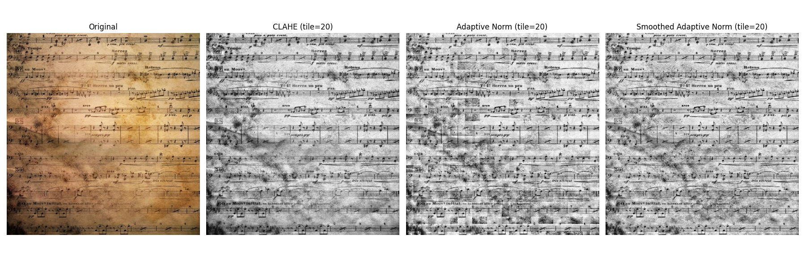

# Torch Smoothed Adaptive Normalization

## Algorithm

Torch image input normalization algorithm that enhances features such as captions etc.

Below a visualisation comparing the results of the algorithms CLAHE and simply adaptive normalization.

